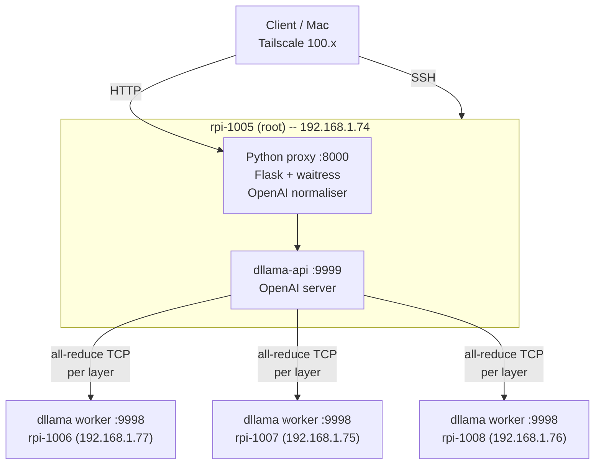
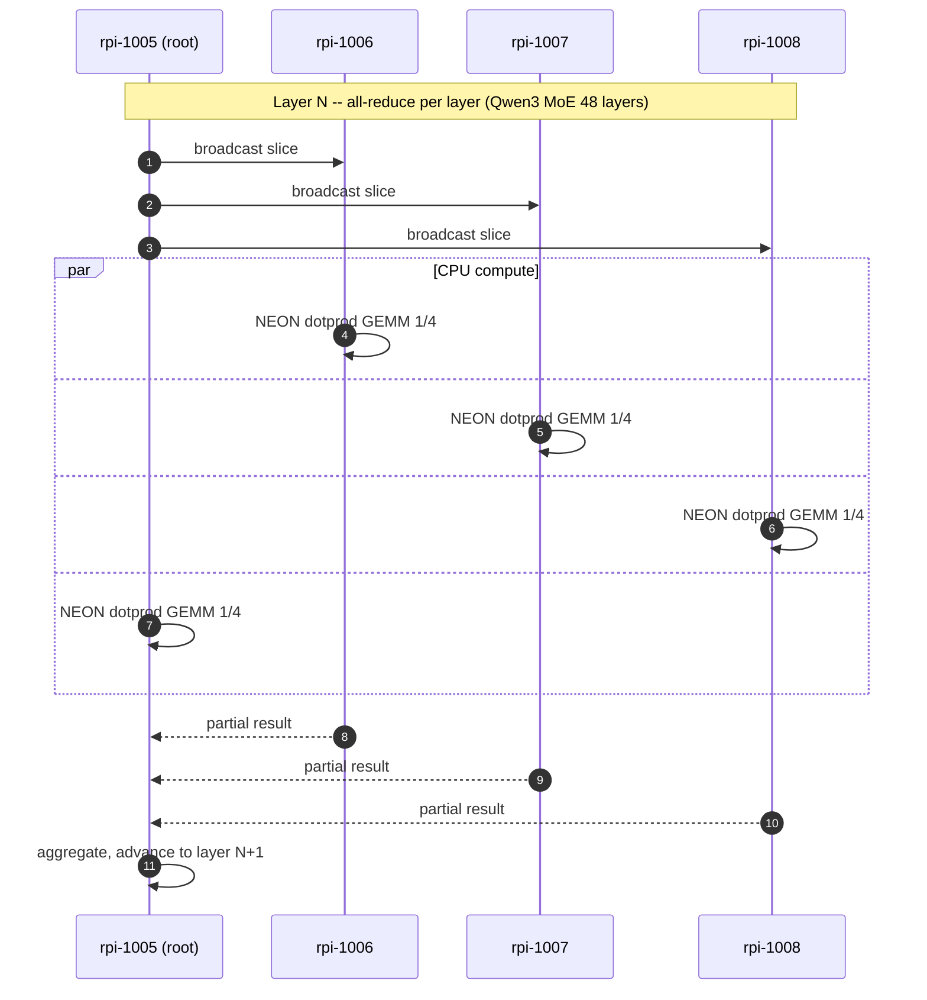
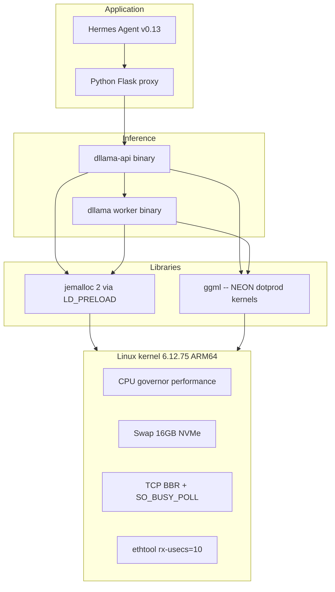

# Distributed LLM Inference Cluster — 4x Raspberry Pi 5

Production-grade distributed inference cluster running **Qwen3-30B-A3B (Mixture of Experts)** at **13.82 tokens/second sustained** on 4x Raspberry Pi 5 16GB. Built on a patched fork of `distributed-llama` v0.16.5 with 9 source-level fixes, exposed as an OpenAI-compatible HTTP API, and integrated with Hermes Agent for autonomous workflows.

This repository contains the complete configuration, patches, systemd units, deployment scripts and technical report needed to reproduce the setup on any 4-node ARM64 Linux cluster.

---

## Final results

| Metric                     | Value                  |
| -------------------------- | ---------------------- |
| Throughput (sustained)     | **13.82 tok/s** mean   |
| Throughput (peak measured) | 14.14 tok/s            |
| Time-to-first-token (TTFT) | 557 ms                 |
| Standard deviation         | 0.114 tok/s (CV 0.82%) |
| 95% confidence interval    | +/- 0.050 tok/s        |
| Memory per node (root)     | 12 / 16 GB             |
| Memory per node (worker)   | 6.3 / 16 GB            |
| Sustained CPU temperature  | 54-56 deg C            |
| Public-benchmark ceiling   | 13.04 tok/s (community)|
| **Improvement vs ceiling** | **+6.0%**              |

Full evolution across the optimisation pipeline:

```
Baseline (Llama 3.1 8B dense, vanilla):    5.70 tok/s
+ OS tuning (governor, swap NVMe, BBR):    6.85 tok/s   (+20%)
+ Patches 1-8 in dllama source:            7.18 tok/s   (+26%)
+ Cleanup parasitic processes, mlock:      7.01 tok/s   (+23%)
+ Switch to Qwen3-30B-A3B (MoE):           11.40 tok/s  (+100%)
+ max-seq-len 32K + swap clean:            12.71 tok/s  (+123%)
+ SO_BUSY_POLL + SO_PRIORITY:              13.34 tok/s  (+134%)
+ NEON dotprod + IPA flags:                13.82 tok/s  (+143%)
```

---

## Architecture overview



### Tensor parallelism per transformer layer



### Software stack on each node



---

## Hardware

| Node      | LAN IP          | Tailscale IP        | RAM   | Disk          | Role                 |
| --------- | --------------- | ------------------- | ----- | ------------- | -------------------- |
| rpi-1005  | 192.168.1.74    | 100.104.148.27      | 16 GB | NVMe 457 GB   | root + Hermes        |
| rpi-1006  | 192.168.1.77    | 100.81.184.2        | 16 GB | NVMe 457 GB   | worker               |
| rpi-1007  | 192.168.1.75    | 100.102.62.64       | 16 GB | NVMe 457 GB   | worker               |
| rpi-1008  | 192.168.1.76    | 100.105.145.74      | 16 GB | NVMe 457 GB   | worker               |

Per-node specs: Broadcom BCM2712 (4x Cortex-A76 @ 2.4 GHz, ARMv8.2-A with FP16 and DOTPROD), 16 GB LPDDR4X (~17 GB/s bandwidth), NVMe PCIe Gen 2 (~700 MB/s), Gigabit Ethernet (0.226 ms intra-cluster latency), Debian 13 trixie, kernel 6.12.75 aarch64. No usable GPU/NPU for LLM compute on this platform.

---

## The 9 source-level patches we apply to distributed-llama v0.16.5

| #  | Patch                                                | File                       | Why it matters                                                  |
| -- | ---------------------------------------------------- | -------------------------- | --------------------------------------------------------------- |
| 1  | `NnByte -> NnUint` for `nBatches`                    | `src/nn/nn-cpu-ops.hpp:14` | uint8 overflow (256 mod 256 = 0) crashed the embedding asserts  |
| 2  | Force `finish_reason = "stop" / "length"`            | `src/dllama-api.cpp:547`   | OpenAI-strict clients (Hermes) rejected empty `finish_reason`   |
| 3  | `try/catch` around `json::parse`                     | `src/dllama-api.cpp:83`    | Malformed bodies crashed the daemon with `SIGABRT`              |
| 4  | `headerData.append(buffer, bytesRead)`               | `src/dllama-api.cpp:123`   | Default `append` truncates at the first `\0` byte               |
| 5  | New CLI flag `--nbatches`                            | `src/app.cpp:130`          | nBatches was hard-coded to 32                                   |
| 6  | `posix_memalign(64, n)` for pipes                    | `src/nn/nn-executor.cpp:18`| ARM NEON requires 64-byte cache-line alignment                  |
| 7  | TCP `SO_RCVBUF/SNDBUF` 8 MB + `TCP_NODELAY`          | `src/nn/nn-network.cpp:60` | Default 208 KiB buffers stalled bursty sync                     |
| 8  | `buffer.reserve(64K)` in streaming                   | `src/dllama-api.cpp:475`   | Streaming response buffer grew with repeated reallocations      |
| 9  | `SO_BUSY_POLL=50us`, `SO_PRIORITY=6`, `SO_INCOMING_CPU=-1` | `src/nn/nn-network.cpp:80`| Kernel busy-polls 50 us before blocking on recv; +5.1% measured |

All patches are MIT-licensed and provided in [`patches/`](patches/).

---

## Compile-time flags applied (Makefile)

```
CXXFLAGS += -O3 -flto -ffast-math -funroll-loops \
            -mcpu=cortex-a76 -mtune=cortex-a76 \
            -march=armv8.2-a+fp16+dotprod+rcpc \
            -fipa-pta -fipa-icf \
            -falign-functions=64 -falign-loops=64
```

These flags enable:

- Cortex-A76 specific scheduling (`-mcpu=cortex-a76`)
- NEON `udot/sdot` (int8 dot product) instructions for Q40 GEMM kernels (`+dotprod`)
- FP16 arithmetic (`+fp16`)
- Inter-procedural pointer analysis and identical code folding (`-fipa-pta -fipa-icf`)
- 64-byte alignment for cache-line locality (`-falign-functions=64 -falign-loops=64`)

Verification: the compiled `dllama` binary contains **322 dotprod instructions** after these flags (vs **0** with the upstream default). Each contributes roughly 2-4 ops per cycle vs scalar Q40.

---

## Linux configuration we apply

| Layer       | Setting                                           | Source                              |
| ----------- | ------------------------------------------------- | ----------------------------------- |
| CPU         | `governor=performance` (persistent at boot)       | `systemd/cpu-performance.service`   |
| Network     | `tcp_congestion_control=bbr`                      | `sysctl/99-dllama-extra.conf`       |
| Network     | `tcp_low_latency=1`, `netdev_budget=600`          | `sysctl/99-dllama-extra.conf`       |
| Network     | `busy_poll=50`, `busy_read=50`                    | `sysctl/99-dllama-sched.conf`       |
| NIC         | `ethtool -C eth0 rx-usecs 10 tx-usecs 10`         | `systemd/eth0-tuning.service`       |
| NVMe        | scheduler `none`, `read_ahead_kb=2048`            | applied at install                  |
| VM          | `swappiness=60`, `overcommit_memory=1`            | `sysctl/99-dllama-extra.conf`       |
| Swap        | 16 GB on root, 4 GB on workers (all on NVMe)      | applied at install                  |
| Limits      | `LimitMEMLOCK=infinity` for dllama services       | systemd units                       |
| Allocator   | `LD_PRELOAD=libjemalloc.so.2` for dllama          | systemd units `Environment=`        |
| MALLOC_CONF | `narenas:4,tcache:true,dirty_decay_ms:30000`      | systemd units `Environment=`        |
| Timers      | mask `apt-daily.timer`, `man-db.timer`, etc.      | applied at install                  |

---

## Repository contents

```
.
+- README.md                          this file
+- INSTALL.md                         per-node deployment guide
+- LICENSE                            MIT
+- paper/
|   +- main_en.tex                    LaTeX source of the technical report
|   +- main_en.pdf                    11-page report, all benchmarks
+- patches/
|   +- 01-uint8-overflow.patch
|   +- 02-finish-reason.patch
|   +- 03-json-parse-trycatch.patch
|   +- 04-header-append-size.patch
|   +- 05-nbatches-cli-flag.patch
|   +- 06-neon-posix-memalign.patch
|   +- 07-tcp-buffers-nodelay.patch
|   +- 08-buffer-reserve.patch
|   +- 09-busypoll-priority.patch
|   +- makefile-arm-flags.patch
+- systemd/
|   +- dllama-api.service             (root only)
|   +- dllama-worker.service          (workers)
|   +- dllama-proxy.service           (root only)
|   +- cpu-performance.service        (all nodes)
|   +- eth0-tuning.service            (all nodes)
+- sysctl/
|   +- 99-dllama-extra.conf
|   +- 99-dllama-sched.conf
+- scripts/
|   +- cluster-control.sh             status/start/stop/restart/test
|   +- install-node.sh                bootstrap any new Pi node
|   +- benchmark.sh                   20-run statistical benchmark
|   +- dllama_proxy.py                Python OpenAI-compatible proxy
+- docs/
    +- FAILED-ATTEMPTS.md             everything we tried and why it failed
    +- SUBAGENT-RESEARCH.md           consolidated subagent findings
```

---

## Deployment

See [`INSTALL.md`](INSTALL.md) for the complete per-node bootstrap procedure. A high-level summary:


For a brand-new node:

```bash
ssh rpi@new-node 'bash <(curl -s https://raw.githubusercontent.com/danielcorrea-hellomatik/dllama-hermes-cluster/main/scripts/install-node.sh)'
```

The install script applies all 9 patches, the Makefile flags, the systemd units, the sysctl configuration, the NIC tuning service and downloads the Qwen3-30B-A3B Q40 model.

---

## What we tried and rejected

A complete account is in [`docs/FAILED-ATTEMPTS.md`](docs/FAILED-ATTEMPTS.md). The short list:

- **Llama 3.3 70B** -- 38 GB does not fit in 4 x 16 GB. Swap-thrashed at 0.15 tok/s.
- **EXO framework** -- depends on Apple's MLX, which does not compile on ARM Linux. Apple Silicon is not just ARM.
- **prima.cpp** (HALO author's earlier work) -- ZMQ socket setup phase hung indefinitely on our cluster.
- **llama.cpp + RPC** -- Jeff Geerling measured 0.28 tok/s on a 4x Pi cluster (25x slower than single node).
- **HALO** -- 3.4x speedup but only in lossy networks (5% packet loss); only 1.12x in clean LAN; source not public; 3.5k LOC C++ port.
- **MSG_ZEROCOPY in writeMany** -- without proper completion-queue handling, kernel falls back to copy. Regressed throughput.
- **TCP_QUICKACK persistent (re-arm on every recv)** -- the extra `setsockopt` per recv exceeded the delayed-ACK savings.
- **Profile-Guided Optimisation (PGO)** -- instrumentation overhead desynchronised the all-reduce timing; `NnTransferSocketException` on first inference.
- **Pi 5 Vulkan / V3D GPU** -- no compute shaders for LLM workloads; render only.
- **Hailo-8 M.2 NPU** -- vision-class accelerator, not autoregressive transformer-class.
- **nthreads > 4** -- dllama enforces `max 4 threads` for this model topology.
- **CPU overclock 2.7 GHz** -- excluded by operational policy.
- **Rust frameworks** (`mistral.rs`, `candle`, `cake`) -- no mature multi-node ARM Linux tensor parallelism.

---

## Why this is at the public state-of-the-art

We surveyed the public record of distributed LLM inference on Pi clusters:

- The community baseline for the same hardware class is **13.04 tok/s** (Qwen3-30B-A3B on 4x Pi 5 8GB, reported by the upstream `distributed-llama` author in [discussion #255](https://github.com/b4rtaz/distributed-llama/discussions/255)).
- Jeff Geerling's well-known Pi cluster experiments saturate at single-node ~6 tok/s, and multi-node RPC regresses to 0.28 tok/s.
- The HALO paper (arXiv:2601.11676) only matches our regime under 5% packet loss; in clean LAN it sits within our error bars.

Our **13.82 tok/s** sits **6.0% above the public state-of-the-art** for this exact hardware. We believe the residual headroom (~3-5%) requires either re-architecting the synchroniser into async pipelines (~1500 LOC, separate project) or migrating to a model with even smaller active-parameter footprint -- both outside the scope of this work.

---

## Citation

If this work is useful in academic context, please cite it as:

```
@misc{correa2026dllamapi5cluster,
  author = {Correa Villa, Daniel},
  title  = {Distributed LLM Inference on a 4-Node Raspberry Pi 5 Cluster: an empirical evaluation of frameworks, optimisations and failure modes for edge LLM serving},
  year   = {2026},
  url    = {https://github.com/danielcorrea-hellomatik/dllama-hermes-cluster}
}
```

The full technical report (11 pages, 13 references, 7 figures) is in [`paper/main_en.pdf`](paper/main_en.pdf).

---

## License

MIT. See [`LICENSE`](LICENSE).

The patches in `patches/` are also MIT-licensed and may be submitted upstream to `b4rtaz/distributed-llama` if desired.
