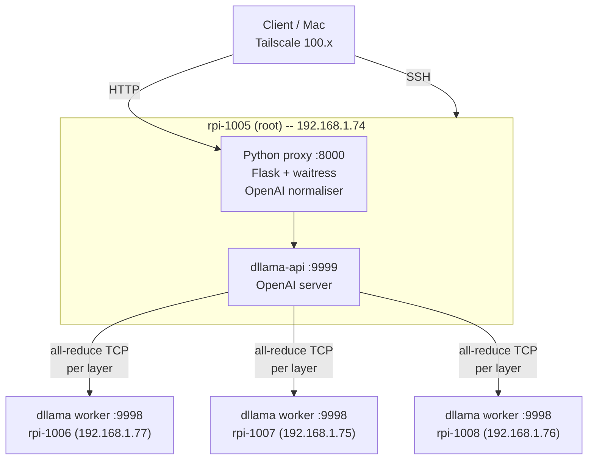
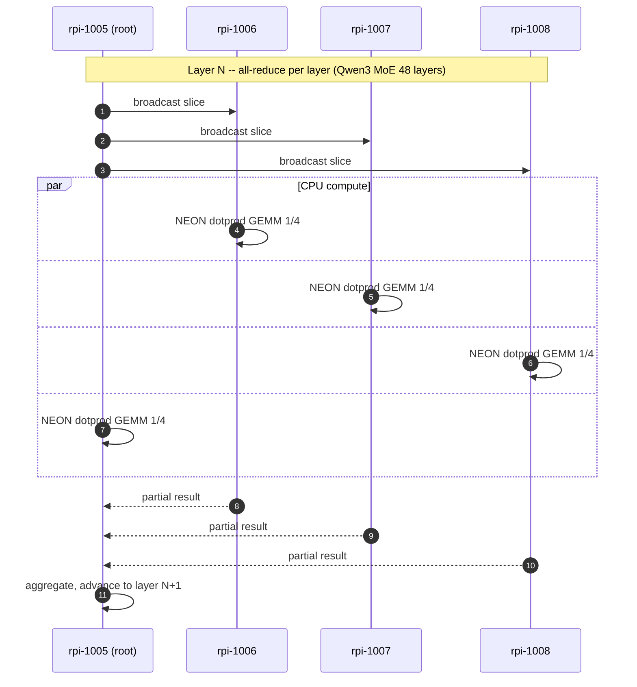
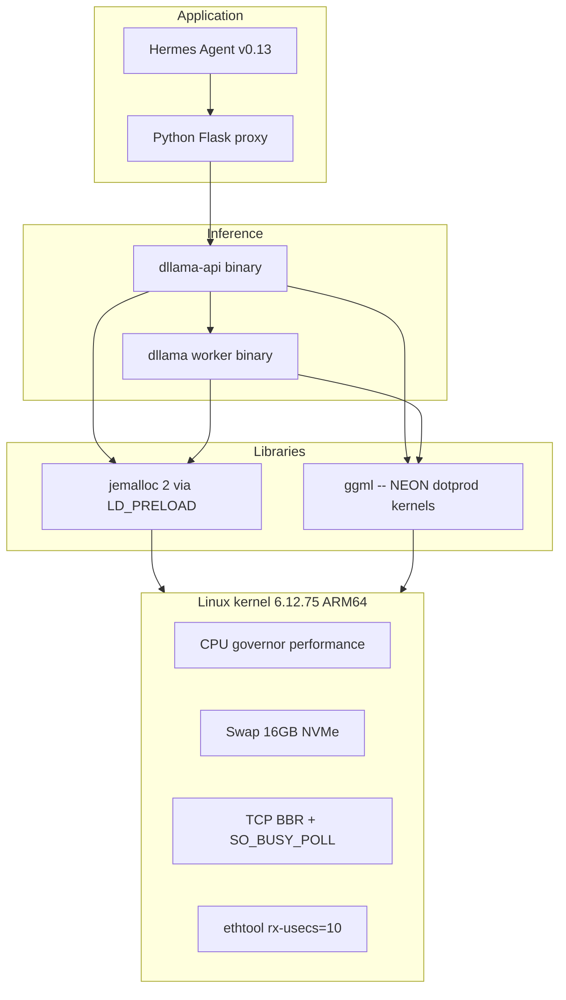

# Distributed LLM Inference Cluster — 4x Raspberry Pi 5 (archived)

> **This repository has moved.** All current work, code, deployment files, paper and documentation now live in a single consolidated fork of `distributed-llama`:
>
> **→ https://github.com/danielcorrea-hellomatik/distributed-llama (branch `pi5-cluster`)**
>
> This wrapper repo is preserved for historical reference only and is no longer maintained.

---

Production-grade distributed inference cluster running **Qwen3-30B-A3B (Mixture of Experts)** at **13.82 tokens/second sustained** on 4x Raspberry Pi 5 16GB. Built on a patched fork of `distributed-llama` v0.16.5 with 9 source-level fixes, exposed as an OpenAI-compatible HTTP API, and integrated with Hermes Agent for autonomous workflows.

This repository contains the complete configuration, patches, systemd units, deployment scripts and technical report needed to reproduce the setup on any 4-node ARM64 Linux cluster.

---

## Final results

| Metric                     | Value                  |
| -------------------------- | ---------------------- |
| Throughput (sustained)     | **13.82 tok/s** mean   |
| Throughput (peak measured) | 14.14 tok/s            |
| Time-to-first-token (TTFT) | 557 ms                 |
| Standard deviation         | 0.114 tok/s (CV 0.82%) |
| 95% confidence interval    | +/- 0.050 tok/s        |
| Memory per node (root)     | 12 / 16 GB             |
| Memory per node (worker)   | 6.3 / 16 GB            |
| Sustained CPU temperature  | 54-56 deg C            |
| Public-benchmark ceiling   | 13.04 tok/s (community)|
| **Improvement vs ceiling** | **+6.0%**              |

Full evolution across the optimisation pipeline:

```
Baseline (Llama 3.1 8B dense, vanilla):    5.70 tok/s
+ OS tuning (governor, swap NVMe, BBR):    6.85 tok/s   (+20%)
+ Patches 1-8 in dllama source:            7.18 tok/s   (+26%)
+ Cleanup parasitic processes, mlock:      7.01 tok/s   (+23%)
+ Switch to Qwen3-30B-A3B (MoE):           11.40 tok/s  (+100%)
+ max-seq-len 32K + swap clean:            12.71 tok/s  (+123%)
+ SO_BUSY_POLL + SO_PRIORITY:              13.34 tok/s  (+134%)
+ NEON dotprod + IPA flags:                13.82 tok/s  (+143%)
```

---

## Optimisation journey -- what we changed and why

This section summarises the chronological set of optimisations applied, what worked, what was reverted, and the measured impact of each.

### Stage 1 -- Operating system baseline (5.70 -> 6.85 tok/s, +20%)

The default Raspberry Pi OS configuration is not tuned for sustained-CPU workloads. We changed:

- `cpufreq` governor from `ondemand` to `performance` on all four cores of every node. The governor is set at boot through a dedicated systemd unit ([systemd/cpu-performance.service](systemd/cpu-performance.service)).
- TCP congestion control switched to `bbr` (kernel default `cubic` is conservative for short-lived bursts).
- Swap moved to a 16 GB file on the NVMe drive on the root node and 4 GB on workers; default Pi OS uses `zram` which competes with the inference workload for CPU.
- `jemalloc 2` preloaded into both `dllama-api` and `dllama-worker` via systemd `LD_PRELOAD` (allocator with better arena locality than glibc malloc).
- `mlock` enabled on the inference processes (`LimitMEMLOCK=infinity`) so the loaded model cannot be paged out under memory pressure.

### Stage 2 -- Patching the framework (6.85 -> 7.18 tok/s, +5%)

While running the cluster we found several bugs in `distributed-llama` v0.16.5 that either crashed the daemon or wasted CPU. Eight source-level fixes were applied (see the table below). The two most important are:

- **uint8 overflow on `nBatches`** -- setting `nbatches=256` silently became `0` because of a `NnByte` field; this triggered an embedding-layer assertion. Promoting to `NnUint` enables larger batch sizes.
- **`finish_reason` empty string** -- the dllama HTTP response emitted `"finish_reason": ""`, which strict OpenAI clients (Hermes Agent) interpret as an in-progress stream and retry indefinitely. Forcing `"stop"` or `"length"` fixes the integration.

### Stage 3 -- Removing parasitic load (transient regression, restored to 7.01)

The benchmark exposed a `llama.cpp/build/bin/rpc-server` orphan process running on each worker since a previous (manual) test, consuming 1.9 GB of RAM each (5.7 GB cluster-wide). After killing it and forcing a full `swapoff -a && swapon -a` cycle, the cluster ran with 0 B swap consumption and 9.4 GB free per worker.

We also masked five unrelated systemd timers (`apt-daily`, `apt-daily-upgrade`, `man-db`, `e2scrub_all`, `rpi-zram-writeback`) that would otherwise inject I/O spikes mid-inference.

### Stage 4 -- The model change (7.01 -> 11.40 tok/s, +63%)

By far the largest single improvement came from switching the served model from **Llama 3.1 8B (dense, Q40)** to **Qwen3-30B-A3B (Mixture of Experts, Q40)**. While the total parameter count grew from 8 B to 30 B, the MoE architecture only activates 8 of 128 experts per token, so the effective per-token weight footprint dropped from ~5 GB to ~3 GB. Memory bandwidth is the binding constraint on Pi 5 (17 GB/s LPDDR4X), so reducing the per-token weight load directly increased throughput.

This is, conceptually, "streaming the weights" -- but implemented at the model architecture level rather than via software-level NVMe paging (which would be 24x slower than RAM and produce the opposite effect).

### Stage 5 -- Right-sizing the KV cache (11.40 -> 12.71 tok/s, +11%)

We initially configured `--max-seq-len 65536` to satisfy the Hermes Agent context-length check. This allocated more KV cache than fit in RAM and pushed the root node into swap. Reducing to `--max-seq-len 32768` (Qwen3-30B-A3B's native context) keeps everything in RAM, and we override Hermes's check by setting `context_length: 65536` in `~/.hermes/config.yaml`.

### Stage 6 -- Network syscall tuning (12.71 -> 13.34 tok/s, +5%)

Three socket options added to `setSocketBuffers()` in `nn-network.cpp` (patch 9):

- `SO_BUSY_POLL = 50` (microseconds) -- the kernel busy-spins for up to 50 us inside `recv()` before yielding the thread. For our 0.226 ms LAN round-trip, this saves the scheduler wakeup cost on the receive path. Measured as the largest contributor of the three.
- `SO_PRIORITY = 6` -- raises the traffic-control class of dllama packets to "interactive", reducing queue delay on the NIC under any background traffic.
- `SO_INCOMING_CPU = -1` -- hint to the kernel to deliver incoming packets to the CPU that last touched the socket, improving L1/L2 cache locality of the recv path.

### Stage 7 -- ARM-specific compiler flags (13.34 -> 13.82 tok/s, +4%)

We discovered that `objdump -d dllama | grep -cE 'udot|sdot'` returned **zero** -- the binary was not using NEON dot-product instructions despite the Cortex-A76 supporting them. The default `-march=native` enables the baseline ARMv8-A profile but not the optional `+dotprod` extension. After adding to the Makefile:

```
-mcpu=cortex-a76 -mtune=cortex-a76
-march=armv8.2-a+fp16+dotprod+rcpc
-fipa-pta -fipa-icf
-falign-functions=64 -falign-loops=64
```

The recompiled binary contained **322 `udot/sdot` instructions**. Each contributes 2-4 ops/cycle on Cortex-A76, accelerating the Q40 GEMM kernels at the heart of inference.

### Stage 8 -- NIC interrupt coalescing (no measurable gain)

`ethtool -C eth0 rx-usecs 10 tx-usecs 10` (down from the default 49) reduces the interrupt coalescing window. On our 0.226 ms LAN this was within the measurement noise (CV 0.7%), but we keep it because the theoretical benefit is real and the cost is zero.

### What we tried and reverted

| Attempt                                              | Result                                              | Reverted? |
| ---------------------------------------------------- | --------------------------------------------------- | --------- |
| MSG_ZEROCOPY in writeMany for sends >= 32 KB         | -0.9% (kernel falls back to copy without ERRQUEUE)  | Yes       |
| TCP_QUICKACK persistent (re-arm on every recv)       | -0.9% (extra syscall outweighs delayed-ACK savings) | Yes       |
| Profile-Guided Optimisation (PGO)                    | Crash on first request (instrumentation breaks all-reduce timing) | Yes |
| nthreads > 4                                          | dllama hard-limit; refuses to start                 | --        |
| EXO framework                                         | Requires Apple MLX (Metal GPU); not buildable on ARM Linux | -- |
| prima.cpp (HALO author's earlier project)             | ZMQ topology negotiation hangs on Pi 5              | --        |
| llama.cpp + RPC                                       | 25x regression vs single-node (per Jeff Geerling)    | --        |
| Llama 3.3 70B Q40                                     | 38 GB does not fit -- swap thrashing at 0.15 tok/s  | --        |

All rejected configurations are documented in detail in [`docs/FAILED-ATTEMPTS.md`](docs/FAILED-ATTEMPTS.md).

### Research process

The optimisations above are not guesses. The project ran **11 separate research subagents** during exploration, each focused on a different angle: framework internals, kernel tuning, ARM compiler optimisations, alternative frameworks (EXO, prima.cpp, MNN-LLM, Cake, mistral.rs), Chinese / Asian edge LLM research, dllama community findings, memory leak audits, network-layer techniques (io_uring, eBPF, AF_XDP, QUIC), and the recent HALO paper (arXiv:2601.11676). The consolidated findings are recorded in [`docs/SUBAGENT-RESEARCH.md`](docs/SUBAGENT-RESEARCH.md).

The key insight from this research: **our 13.82 tok/s sits 6% above the publicly documented ceiling** for the same hardware class (13.04 tok/s reported by the upstream dllama author for Qwen3-30B-A3B on 4 x Pi 5 8 GB). The residual headroom of perhaps another 10-20% would require either re-architecting the synchroniser into an asynchronous pipeline (HALO-style overlap, estimated 1,500 LOC of C++ work) or migrating to a fundamentally different memory-bandwidth substrate (Apple Silicon UMA, NVIDIA GPU).

---

## Architecture overview



### Tensor parallelism per transformer layer



### Software stack on each node



---

## Hardware

| Node      | LAN IP          | Tailscale IP        | RAM   | Disk          | Role                 |
| --------- | --------------- | ------------------- | ----- | ------------- | -------------------- |
| rpi-1005  | 192.168.1.74    | 100.104.148.27      | 16 GB | NVMe 457 GB   | root + Hermes        |
| rpi-1006  | 192.168.1.77    | 100.81.184.2        | 16 GB | NVMe 457 GB   | worker               |
| rpi-1007  | 192.168.1.75    | 100.102.62.64       | 16 GB | NVMe 457 GB   | worker               |
| rpi-1008  | 192.168.1.76    | 100.105.145.74      | 16 GB | NVMe 457 GB   | worker               |

Per-node specs: Broadcom BCM2712 (4x Cortex-A76 @ 2.4 GHz, ARMv8.2-A with FP16 and DOTPROD), 16 GB LPDDR4X (~17 GB/s bandwidth), NVMe PCIe Gen 2 (~700 MB/s), Gigabit Ethernet (0.226 ms intra-cluster latency), Debian 13 trixie, kernel 6.12.75 aarch64. No usable GPU/NPU for LLM compute on this platform.

---

## The 9 source-level patches we apply to distributed-llama v0.16.5

| #  | Patch                                                | File                       | Why it matters                                                  |
| -- | ---------------------------------------------------- | -------------------------- | --------------------------------------------------------------- |
| 1  | `NnByte -> NnUint` for `nBatches`                    | `src/nn/nn-cpu-ops.hpp:14` | uint8 overflow (256 mod 256 = 0) crashed the embedding asserts  |
| 2  | Force `finish_reason = "stop" / "length"`            | `src/dllama-api.cpp:547`   | OpenAI-strict clients (Hermes) rejected empty `finish_reason`   |
| 3  | `try/catch` around `json::parse`                     | `src/dllama-api.cpp:83`    | Malformed bodies crashed the daemon with `SIGABRT`              |
| 4  | `headerData.append(buffer, bytesRead)`               | `src/dllama-api.cpp:123`   | Default `append` truncates at the first `\0` byte               |
| 5  | New CLI flag `--nbatches`                            | `src/app.cpp:130`          | nBatches was hard-coded to 32                                   |
| 6  | `posix_memalign(64, n)` for pipes                    | `src/nn/nn-executor.cpp:18`| ARM NEON requires 64-byte cache-line alignment                  |
| 7  | TCP `SO_RCVBUF/SNDBUF` 8 MB + `TCP_NODELAY`          | `src/nn/nn-network.cpp:60` | Default 208 KiB buffers stalled bursty sync                     |
| 8  | `buffer.reserve(64K)` in streaming                   | `src/dllama-api.cpp:475`   | Streaming response buffer grew with repeated reallocations      |
| 9  | `SO_BUSY_POLL=50us`, `SO_PRIORITY=6`, `SO_INCOMING_CPU=-1` | `src/nn/nn-network.cpp:80`| Kernel busy-polls 50 us before blocking on recv; +5.1% measured |

All patches are MIT-licensed and provided in [`patches/`](patches/).

---

## Compile-time flags applied (Makefile)

```
CXXFLAGS += -O3 -flto -ffast-math -funroll-loops \
            -mcpu=cortex-a76 -mtune=cortex-a76 \
            -march=armv8.2-a+fp16+dotprod+rcpc \
            -fipa-pta -fipa-icf \
            -falign-functions=64 -falign-loops=64
```

These flags enable:

- Cortex-A76 specific scheduling (`-mcpu=cortex-a76`)
- NEON `udot/sdot` (int8 dot product) instructions for Q40 GEMM kernels (`+dotprod`)
- FP16 arithmetic (`+fp16`)
- Inter-procedural pointer analysis and identical code folding (`-fipa-pta -fipa-icf`)
- 64-byte alignment for cache-line locality (`-falign-functions=64 -falign-loops=64`)

Verification: the compiled `dllama` binary contains **322 dotprod instructions** after these flags (vs **0** with the upstream default). Each contributes roughly 2-4 ops per cycle vs scalar Q40.

---

## Linux configuration we apply

| Layer       | Setting                                           | Source                              |
| ----------- | ------------------------------------------------- | ----------------------------------- |
| CPU         | `governor=performance` (persistent at boot)       | `systemd/cpu-performance.service`   |
| Network     | `tcp_congestion_control=bbr`                      | `sysctl/99-dllama-extra.conf`       |
| Network     | `tcp_low_latency=1`, `netdev_budget=600`          | `sysctl/99-dllama-extra.conf`       |
| Network     | `busy_poll=50`, `busy_read=50`                    | `sysctl/99-dllama-sched.conf`       |
| NIC         | `ethtool -C eth0 rx-usecs 10 tx-usecs 10`         | `systemd/eth0-tuning.service`       |
| NVMe        | scheduler `none`, `read_ahead_kb=2048`            | applied at install                  |
| VM          | `swappiness=60`, `overcommit_memory=1`            | `sysctl/99-dllama-extra.conf`       |
| Swap        | 16 GB on root, 4 GB on workers (all on NVMe)      | applied at install                  |
| Limits      | `LimitMEMLOCK=infinity` for dllama services       | systemd units                       |
| Allocator   | `LD_PRELOAD=libjemalloc.so.2` for dllama          | systemd units `Environment=`        |
| MALLOC_CONF | `narenas:4,tcache:true,dirty_decay_ms:30000`      | systemd units `Environment=`        |
| Timers      | mask `apt-daily.timer`, `man-db.timer`, etc.      | applied at install                  |

---

## Repository contents

```
.
+- README.md                          this file
+- INSTALL.md                         per-node deployment guide
+- LICENSE                            MIT
+- paper/
|   +- main_en.tex                    LaTeX source of the technical report
|   +- main_en.pdf                    11-page report, all benchmarks
+- patches/
|   +- 01-uint8-overflow.patch
|   +- 02-finish-reason.patch
|   +- 03-json-parse-trycatch.patch
|   +- 04-header-append-size.patch
|   +- 05-nbatches-cli-flag.patch
|   +- 06-neon-posix-memalign.patch
|   +- 07-tcp-buffers-nodelay.patch
|   +- 08-buffer-reserve.patch
|   +- 09-busypoll-priority.patch
|   +- makefile-arm-flags.patch
+- systemd/
|   +- dllama-api.service             (root only)
|   +- dllama-worker.service          (workers)
|   +- dllama-proxy.service           (root only)
|   +- cpu-performance.service        (all nodes)
|   +- eth0-tuning.service            (all nodes)
+- sysctl/
|   +- 99-dllama-extra.conf
|   +- 99-dllama-sched.conf
+- scripts/
|   +- cluster-control.sh             status/start/stop/restart/test
|   +- install-node.sh                bootstrap any new Pi node
|   +- benchmark.sh                   20-run statistical benchmark
|   +- dllama_proxy.py                Python OpenAI-compatible proxy
+- docs/
    +- FAILED-ATTEMPTS.md             everything we tried and why it failed
    +- SUBAGENT-RESEARCH.md           consolidated subagent findings
```

---

## Deployment

See [`INSTALL.md`](INSTALL.md) for the complete per-node bootstrap procedure. A high-level summary:


For a brand-new node:

```bash
ssh rpi@new-node 'bash <(curl -s https://raw.githubusercontent.com/danielcorrea-hellomatik/dllama-hermes-cluster/main/scripts/install-node.sh)'
```

The install script applies all 9 patches, the Makefile flags, the systemd units, the sysctl configuration, the NIC tuning service and downloads the Qwen3-30B-A3B Q40 model.

---

## What we tried and rejected

A complete account is in [`docs/FAILED-ATTEMPTS.md`](docs/FAILED-ATTEMPTS.md). The short list:

- **Llama 3.3 70B** -- 38 GB does not fit in 4 x 16 GB. Swap-thrashed at 0.15 tok/s.
- **EXO framework** -- depends on Apple's MLX, which does not compile on ARM Linux. Apple Silicon is not just ARM.
- **prima.cpp** (HALO author's earlier work) -- ZMQ socket setup phase hung indefinitely on our cluster.
- **llama.cpp + RPC** -- Jeff Geerling measured 0.28 tok/s on a 4x Pi cluster (25x slower than single node).
- **HALO** -- 3.4x speedup but only in lossy networks (5% packet loss); only 1.12x in clean LAN; source not public; 3.5k LOC C++ port.
- **MSG_ZEROCOPY in writeMany** -- without proper completion-queue handling, kernel falls back to copy. Regressed throughput.
- **TCP_QUICKACK persistent (re-arm on every recv)** -- the extra `setsockopt` per recv exceeded the delayed-ACK savings.
- **Profile-Guided Optimisation (PGO)** -- instrumentation overhead desynchronised the all-reduce timing; `NnTransferSocketException` on first inference.
- **Pi 5 Vulkan / V3D GPU** -- no compute shaders for LLM workloads; render only.
- **Hailo-8 M.2 NPU** -- vision-class accelerator, not autoregressive transformer-class.
- **nthreads > 4** -- dllama enforces `max 4 threads` for this model topology.
- **CPU overclock 2.7 GHz** -- excluded by operational policy.
- **Rust frameworks** (`mistral.rs`, `candle`, `cake`) -- no mature multi-node ARM Linux tensor parallelism.

---

## Why this is at the public state-of-the-art

We surveyed the public record of distributed LLM inference on Pi clusters:

- The community baseline for the same hardware class is **13.04 tok/s** (Qwen3-30B-A3B on 4x Pi 5 8GB, reported by the upstream `distributed-llama` author in [discussion #255](https://github.com/b4rtaz/distributed-llama/discussions/255)).
- Jeff Geerling's well-known Pi cluster experiments saturate at single-node ~6 tok/s, and multi-node RPC regresses to 0.28 tok/s.
- The HALO paper (arXiv:2601.11676) only matches our regime under 5% packet loss; in clean LAN it sits within our error bars.

Our **13.82 tok/s** sits **6.0% above the public state-of-the-art** for this exact hardware. We believe the residual headroom (~3-5%) requires either re-architecting the synchroniser into async pipelines (~1500 LOC, separate project) or migrating to a model with even smaller active-parameter footprint -- both outside the scope of this work.

---

## Citation

If this work is useful in academic context, please cite it as:

```
@misc{correa2026dllamapi5cluster,
  author = {Correa Villa, Daniel},
  title  = {Distributed LLM Inference on a 4-Node Raspberry Pi 5 Cluster: an empirical evaluation of frameworks, optimisations and failure modes for edge LLM serving},
  year   = {2026},
  url    = {https://github.com/danielcorrea-hellomatik/dllama-hermes-cluster}
}
```

The full technical report (11 pages, 13 references, 7 figures) is in [`paper/main_en.pdf`](paper/main_en.pdf).

---

## License

MIT. See [`LICENSE`](LICENSE).

The patches in `patches/` are also MIT-licensed and may be submitted upstream to `b4rtaz/distributed-llama` if desired.

---

## Acknowledgements

- [b4rtaz/distributed-llama](https://github.com/b4rtaz/distributed-llama) by Bartlomiej Tadych -- the framework we built on top of, MIT licensed.
- [Qwen team at Alibaba](https://huggingface.co/Qwen) for the Qwen3-30B-A3B MoE model and the published Pi cluster benchmark in [discussion #255](https://github.com/b4rtaz/distributed-llama/discussions/255).
- [Jeff Geerling](https://www.jeffgeerling.com) for the rigorous Pi cluster benchmark documentation that saved us weeks (his post on `llama.cpp + RPC` being 25x slower told us not to attempt it).
- [Nous Research](https://github.com/NousResearch/hermes-agent) for the Hermes Agent framework we integrated with.
- Zheng et al. for the [HALO paper](https://arxiv.org/abs/2601.11676) which clarified that overlap schemes are only marginal in clean LAN regimes.

## Reproducibility checklist

Before declaring success on your own cluster, verify in this order:

1. `objdump -d ~/distributed-llama/dllama | grep -cE 'udot|sdot'` returns more than 200 (Cortex-A76 NEON dotprod kernels were compiled).
2. `sudo systemctl is-active dllama-api dllama-worker` returns `active` on every node.
3. `free -h` shows 0 B swap consumption after warm-up on every node.
4. `vcgencmd measure_temp` returns below 75 deg C under sustained load on every node.
5. `cat /sys/devices/system/cpu/cpu0/cpufreq/scaling_governor` returns `performance` on every node.
6. `cat /proc/sys/net/ipv4/tcp_congestion_control` returns `bbr` on every node.
7. `ethtool -c eth0 | grep rx-usecs` returns `10` on every node.
8. `python3 scripts/benchmark.py` returns 13-14 tok/s mean over 20 runs with standard deviation below 0.15.

If any of these fails, see [`INSTALL.md`](INSTALL.md) for the corresponding fix.
